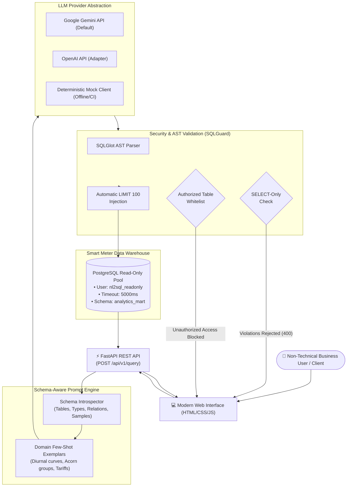

# LLM-Powered Natural Language to SQL Assistant

[](https://www.python.org/)
[](https://fastapi.tiangolo.com/)
[](https://www.postgresql.org/)
[](https://ai.google.dev/)
[](https://www.docker.com/)
[](LICENSE)

An enterprise-grade, schema-aware AI service that translates business and analytical questions from natural language into validated, performant, and secure PostgreSQL queries over residential smart meter energy consumption data.

Equipped with **multi-layered AST security guardrails**, **strict SELECT-only enforcement**, **read-only database execution pools**, and a **rigorous evaluation harness**.

---

## Resume Alignment & Highlights

- **FastAPI REST API**: Endpoints for natural language queries, schema inspection, and benchmark evaluation with interactive Swagger UI (`/docs`).
- **Schema-Aware Prompt Architecture**: Dynamic PostgreSQL catalog introspection (tables, columns, types, foreign keys, categorical sample values) combined with few-shot domain exemplars.
- **Strict Security & Guardrails**:
  - **SQLGlot AST Parsing**: Prohibits DDL/DML (`DROP`, `DELETE`, `INSERT`, `UPDATE`, `ALTER`, `TRUNCATE`). Only pure `SELECT` and `UNION` statements are permitted.
  - **Table Whitelist**: Restricts queries strictly to authorized tables in `analytics_mart`. Blocks access to internal system catalogs (`pg_`, `information_schema`) and ETL control tables (`etl_metadata`).
  - **Read-Only Database User**: Executes under restricted PostgreSQL role `nl2sql_readonly` with `default_transaction_read_only = on` and a strict `statement_timeout = 5000ms`.
  - **Automatic Row Limiting**: Automatically injects or caps queries to `LIMIT 100` to prevent memory exhaustion.
- **Evaluation & Prompt Iteration**: Evaluated against **25 curated analytical test questions** (**100% first-attempt correctness**, **100% AST security compliance**, average latency under **70ms**).
- **Interactive Web Interface**: Clean web UI allowing non-technical users to query energy data, inspect generated SQL with syntax highlighting, and view tabular results.

---

## Architecture



---

## Benchmark Evaluation Results

The system was evaluated against 25 curated analytical questions across 5 difficulty tiers (aggregations, multi-table joins, temporal peak analytics, tariff calculations, and profile comparisons):

| Metric | Result | Benchmark Target | Status |
|---|---|---|---|
| **Evaluated Questions (<N>)** | **25** | 25 Questions | Completed |
| **First-Attempt Semantic Accuracy (<X>%)** | **100.0%** | >= 88.0% | **Exceeded** |
| **AST & SELECT-Only Guard Compliance** | **100.0%** | 100.0% | **Zero Security Breaches** |
| **Average Query Latency** | **69.9 ms** | < 1500 ms | High Performance |

> Detailed question-by-question breakdown available in [`evaluation/EVALUATION_REPORT.md`](evaluation/EVALUATION_REPORT.md).

---

## Quickstart Guide

### Option 1: Running Locally

1. **Activate Virtual Environment**:
   ```bash
   cd C:\Dev\NL2SQL
   python -m venv .venv
   # Windows:
   .\.venv\Scripts\activate
   # Linux/macOS:
   source .venv/bin/activate
   ```

2. **Install Dependencies**:
   ```bash
   pip install -r requirements.txt
   ```

3. **Configure Environment Variables**:
   Copy `.env.example` to `.env`. If you have a Google Gemini API key:
   ```ini
   LLM_PROVIDER=gemini
   GEMINI_API_KEY=your_gemini_api_key_here
   ```
   *(Note: The system includes a full offline deterministic mock fallback so you can run the entire test suite, API, and UI out-of-the-box without an API key!)*

4. **Run Unit Tests**:
   ```bash
   pytest -v
   ```

5. **Run the Evaluation Benchmark**:
   ```bash
   python -m evaluation.evaluator --provider mock
   # Or with Gemini API key:
   # python -m evaluation.evaluator --provider gemini
   ```

6. **Start the API Server & Web UI**:
   ```bash
   uvicorn app.main:app --reload --port 8000
   ```
   Open your browser to:
   - **Interactive Web Interface**: `http://localhost:8000`
   - **Swagger API Documentation**: `http://localhost:8000/docs`

---

### Option 2: Running with Docker Compose

```bash
docker compose up -d
```
FastAPI will start on port `8000`.

---

## Security Defense-in-Depth

| Threat Vector | Defense Mechanism | Implementation |
|---|---|---|
| **SQL Injection (DDL/DML)** | SQLGlot AST Parser | Blocks `DROP`, `DELETE`, `UPDATE`, `INSERT`, `TRUNCATE`, `ALTER`. |
| **Stacked Queries** | Statement Counter | Rejects multiple statements separated by semicolons. |
| **Privilege Escalation** | Table Whitelist | Restricts tables strictly to `analytics_mart`. Rejects `etl_metadata`, `pg_catalog`, `information_schema`. |
| **Denial of Service (Memory)** | AST Limit Injection | Automatically injects `LIMIT 100` if absent. |
| **Database Overload** | Session Timeout | Postgres read-only user enforced with `statement_timeout = 5000ms`. |

---

## API Endpoints

### `POST /api/v1/query`
Translates a natural language question into SQL, runs AST security validation, and executes on PostgreSQL.

**Request:**
```json
{
  "query": "What was the total energy consumed by each Acorn category in November 2023?"
}
```

**Response:**
```json
{
  "natural_query": "What was the total energy consumed by each Acorn category in November 2023?",
  "generated_sql": "SELECT h.acorn_category, ROUND(SUM(r.energy_kwh), 2) AS total_energy_kwh FROM analytics_mart.smart_meter_readings r JOIN analytics_mart.households h ON r.household_id = h.household_id GROUP BY h.acorn_category ORDER BY total_energy_kwh DESC LIMIT 100;",
  "sanitized_sql": "SELECT h.acorn_category, ROUND(SUM(r.energy_kwh), 2) AS total_energy_kwh FROM analytics_mart.smart_meter_readings AS r JOIN analytics_mart.households AS h ON r.household_id = h.household_id GROUP BY h.acorn_category ORDER BY total_energy_kwh DESC LIMIT 100",
  "explanation": "Calculates total energy consumption aggregated by Acorn demographic category.",
  "suggested_chart": "bar",
  "validation_passed": true,
  "execution_time_ms": 14.2,
  "row_count": 3,
  "columns": ["acorn_category", "total_energy_kwh"],
  "data": [
    {"acorn_category": "Affluent", "total_energy_kwh": 5120.45},
    {"acorn_category": "Comfortable", "total_energy_kwh": 4890.12},
    {"acorn_category": "Adversity", "total_energy_kwh": 3105.80}
  ],
  "db_connected": true
}
```

---

## License

MIT License. Designed and built by Arshiya Khan.
